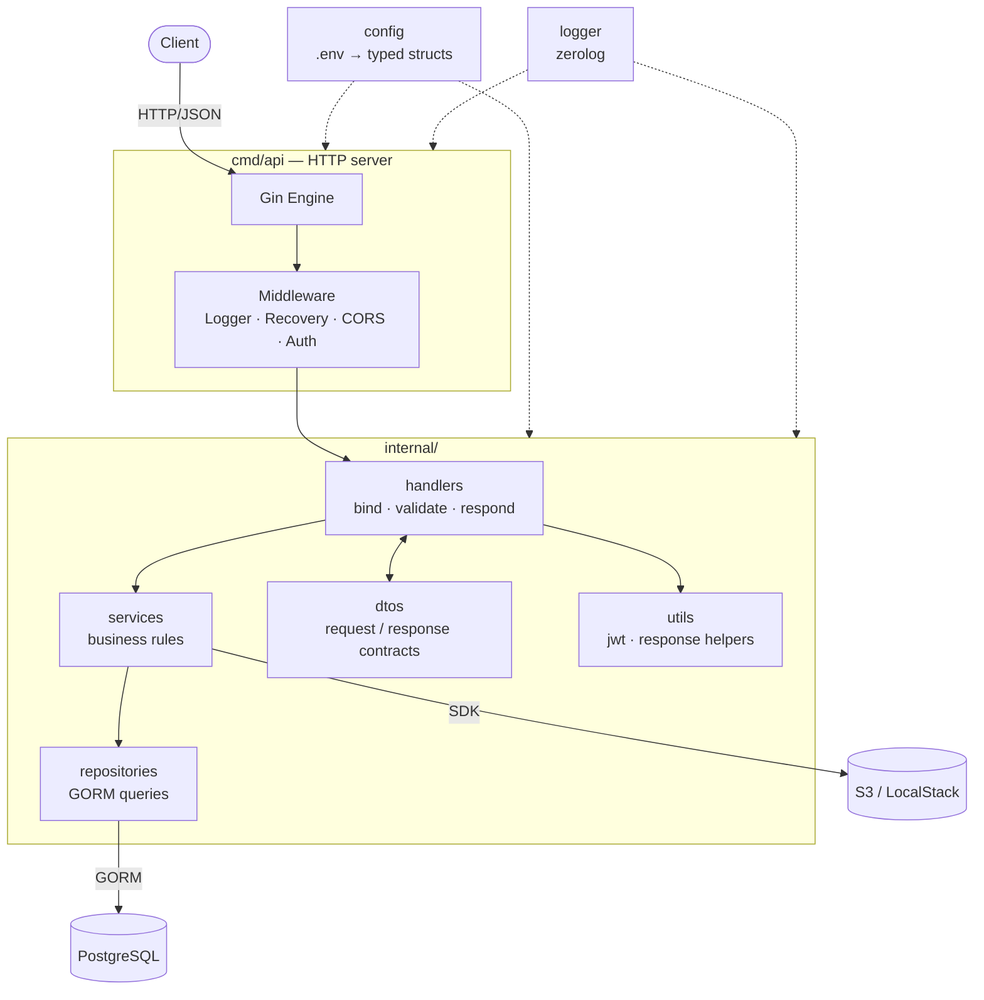
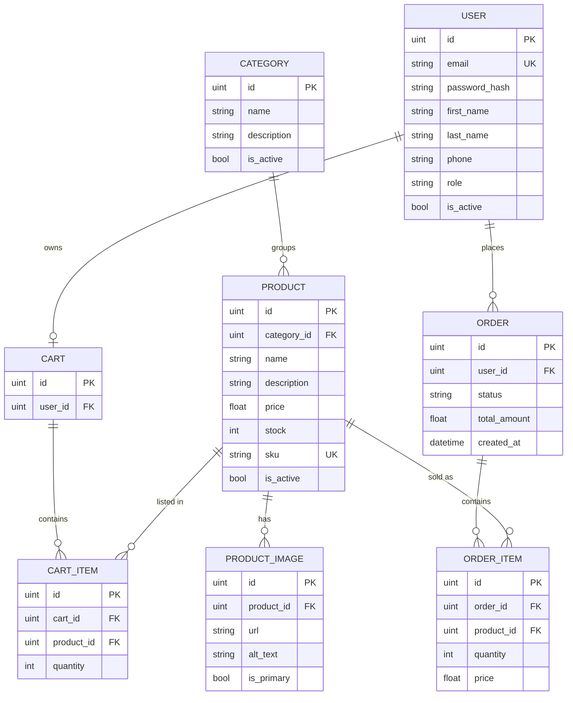

# 🛒 Ecommerce API

> A production-minded e-commerce REST API built in Go — clean layered architecture, JWT authentication, PostgreSQL persistence and a fully containerised local stack.

[](https://go.dev)
[](https://gin-gonic.com)
[](https://gorm.io)
[](https://www.postgresql.org)
[](https://docs.docker.com/compose/)
[](https://golangci-lint.run)
[](#-roadmap)

---

## 📌 Table of Contents

- [Overview](#-overview)
- [Tech Stack](#-tech-stack)
- [Architecture](#-architecture)
- [Project Structure](#-project-structure)
- [Getting Started](#-getting-started)
- [Configuration](#-configuration)
- [Make Targets](#-make-targets)
- [API Reference](#-api-reference)
- [Response Format](#-response-format)
- [Data Model](#-data-model)
- [Development Workflow](#-development-workflow)
- [Roadmap](#-roadmap)
- [Contributing](#-contributing)
- [License](#-license)

---

## 🎯 Overview

**Ecommerce API** is the backend service for an online store. It is designed around a
clear separation of concerns — transport (Gin), business logic (services), persistence
(GORM/PostgreSQL) — so each layer can evolve and be tested independently.

The service covers the full commerce lifecycle:

| Domain | What it handles |
| :--- | :--- |
| 🔐 **Auth** | Registration, login, JWT access + refresh tokens, role-based access (`user` / `admin`) |
| 📦 **Catalog** | Categories and products, SKU management, stock levels, activation flags |
| 🖼️ **Media** | Product images with primary-image selection, uploaded to S3 (LocalStack in dev) |
| 🛍️ **Cart** | Per-user cart, line items, quantity rules, running subtotals and totals |
| 🧾 **Orders** | Order creation from cart, order items with price snapshots, status tracking |

**Engineering highlights**

- ⚡ **Graceful shutdown** — `SIGINT` / `SIGTERM` are trapped, in-flight requests get a 15s
  window to finish, then the DB pool is closed cleanly.
- 📋 **Structured logging** — `zerolog`, with a human-readable console writer in dev and
  JSON output in `release` mode.
- 🧱 **Consistent response envelope** — every endpoint returns the same JSON shape, with a
  dedicated variant carrying pagination metadata.
- ✅ **Declarative validation** — request DTOs use `binding` tags, so malformed payloads are
  rejected before they ever reach a service.
- 🔁 **Hot reload** — `air` rebuilds and restarts the server on every save.
- 🧹 **Strict linting** — an extensive `golangci-lint` configuration is enforced repo-wide.

---

## 🧰 Tech Stack

| Layer | Technology | Why |
| :--- | :--- | :--- |
| Language | **Go 1.26** | Static typing, fast builds, single-binary deployment |
| HTTP | **Gin 1.12** | High-performance router with a mature middleware ecosystem |
| ORM | **GORM 1.31** + `driver/postgres` | Expressive queries, migrations-friendly, relations out of the box |
| Database | **PostgreSQL 12** | Relational integrity for orders, stock and money |
| Auth | **golang-jwt/v5** | Stateless access + refresh token pair |
| Logging | **rs/zerolog** | Zero-allocation structured logging |
| Config | **joho/godotenv** | `.env` loading with sane in-code defaults |
| Object storage | **AWS S3** / **LocalStack** | Product images, mocked locally at no cost |
| Migrations | **golang-migrate** | Versioned, reversible SQL migrations |
| Live reload | **air** | Sub-second feedback loop in development |
| Quality | **golangci-lint**, `gofmt`, `goimports` | Consistent, vetted codebase |

---

## 🏗 Architecture



**Request lifecycle**

```
Request → Gin Router → Logger → Recovery → CORS → [Auth] → Handler
                                                              │
                                        bind + validate DTO ──┤
                                                              ▼
                                                          Service
                                                              │
                                                          Repository
                                                              │
                                                              ▼
                                                         PostgreSQL
                                                              │
                                          utils.SuccessResponse ◀──
```

---

## 📁 Project Structure

```
ecommerce/
├── cmd/
│   └── api/
│       └── main.go            # Entrypoint: wiring, HTTP server, graceful shutdown
├── internal/
│   ├── config/
│   │   └── config.go          # Env → typed config (Server, Database, JWT, AWS, Upload)
│   ├── database/
│   │   └── database.go        # GORM + PostgreSQL connection factory
│   ├── logger/
│   │   └── logger.go          # zerolog setup (console in dev, JSON in release)
│   ├── server/
│   │   └── server.go          # Engine construction, middleware, route registration
│   ├── dtos/
│   │   ├── auth.go            # Register / Login / Refresh / Profile contracts
│   │   ├── product.go         # Category & Product contracts
│   │   └── order.go           # Cart & Order contracts
│   └── utils/
│       ├── jwt.go             # Token pair generation & validation
│       └── response.go        # Unified success / error / paginated responses
├── db/
│   └── migrations/            # golang-migrate SQL files (NNNN_name.up/down.sql)
├── docker/
│   └── docker-compose.yml     # PostgreSQL + LocalStack (S3, SQS)
├── .air.toml                  # Hot-reload configuration
├── .golangci.yml              # Linter configuration
├── Makefile                   # Developer commands
├── go.mod / go.sum
└── README.md
```

---

## 🚀 Getting Started

### Prerequisites

| Tool | Version | Install |
| :--- | :--- | :--- |
| Go | 1.26+ | https://go.dev/dl |
| Docker + Compose | latest | https://docs.docker.com/get-docker |
| `golang-migrate` | latest | `brew install golang-migrate` |
| `air` *(optional)* | latest | `go install github.com/air-verse/air@latest` |
| `golangci-lint` *(optional)* | latest | `brew install golangci-lint` |

### 1 — Clone

```bash
git clone git@github.com:boriskamtou96/ecommerce.git
cd ecommerce
```

### 2 — Install dependencies

```bash
go mod download
```

### 3 — Create your environment file

```bash
cp .env.example .env   # or create .env from the table below
```

### 4 — Start the infrastructure

```bash
make up          # PostgreSQL on :5432, LocalStack on :4566
```

Create the database if it does not exist yet:

```bash
docker exec -it postgres createdb --username=postgres --owner=postgres ecommerce
```

### 5 — Run the migrations

```bash
set -a && source .env && set +a   # export DB_* for the Makefile
make migrate-up
```

### 6 — Run the API

```bash
make run         # hot reload via air
# or
go run ./cmd/api
```

### 7 — Verify

```bash
curl -s http://localhost:8080/health
```

```json
{ "status": "Ok" }
```

🎉 The API is live on **http://localhost:8080**.

---

## ⚙️ Configuration

All configuration is read from the environment; `.env` is loaded automatically at startup
and every key falls back to a safe default.

### Server

| Variable | Default | Description |
| :--- | :--- | :--- |
| `SERVER_PORT` | `8080` | Port the HTTP server binds to |
| `GIN_MODE` | `debug` | `debug` or `release` — also switches the logger to JSON |

### Database

| Variable | Default | Description |
| :--- | :--- | :--- |
| `DB_HOST` | `localhost` | PostgreSQL host |
| `DB_PORT` | `5432` | PostgreSQL port |
| `DB_USER` | `postgres` | Database user |
| `DB_PASSWORD` | `postgres` | Database password |
| `DB_NAME` | `ecommerce` | Database name |
| `DB_SSLMODE` | `disable` | `disable` locally, `require` in production |

### Authentication

| Variable | Default | Description |
| :--- | :--- | :--- |
| `JWT_SECRET` | `your-secret-key` | HMAC signing secret — **must** be overridden in production |
| `JWT_EXPIRES_IN` | `15m` | Access-token lifetime (Go duration: `15m`, `1h`, `24h`) |
| `JWT_REFRESH_TOKEN_EXPIRES_IN` | `168h` | Refresh-token lifetime (Go durations have no `d` unit — use `168h` for 7 days) |

### Storage & uploads

| Variable | Default | Description |
| :--- | :--- | :--- |
| `AWS_REGION` | `us-east-1` | AWS region |
| `AWS_ACCESS_KEY_ID` | *(empty)* | `test` when using LocalStack |
| `AWS_SECRET_ACCESS_KEY` | *(empty)* | `test` when using LocalStack |
| `AWS_S3_BUCKET_NAME` | *(empty)* | Bucket holding product images |
| `AWS_S3_ENDPOINT` | *(empty)* | `http://localhost:4566` for LocalStack |
| `UPLOAD_DIR` | `./uploads` | Local fallback directory |
| `MAX_UPLOAD_SIZE` | `10485760` | Max upload size in bytes (10 MB) |

<details>
<summary>📄 <b>Sample <code>.env</code></b></summary>

```dotenv
# Server
SERVER_PORT=8080
GIN_MODE=debug

# Database
DB_HOST=localhost
DB_PORT=5432
DB_USER=postgres
DB_PASSWORD=postgres
DB_NAME=ecommerce
DB_SSLMODE=disable

# Auth
JWT_SECRET=change-me-to-a-long-random-string
JWT_EXPIRES_IN=15m
JWT_REFRESH_TOKEN_EXPIRES_IN=168h

# Storage (LocalStack)
AWS_ACCESS_KEY_ID=test
AWS_SECRET_ACCESS_KEY=test
AWS_REGION=us-east-1
AWS_S3_BUCKET_NAME=ecommerce-uploads
AWS_S3_ENDPOINT=http://localhost:4566

# Uploads
UPLOAD_DIR=./uploads
MAX_UPLOAD_SIZE=10485760
```

> ⚠️ `.env` is git-ignored. Never commit real secrets.

</details>

---

## 🛠 Make Targets

```bash
make help                    # List every available target
```

| Target | Description |
| :--- | :--- |
| `make up` | Start PostgreSQL + LocalStack via Docker Compose |
| `make down` | Stop and remove the containers |
| `make migration <name>` | Scaffold a new sequential migration pair |
| `make migrate-up` | Apply all pending migrations |
| `make migrate-down <n>` | Roll back the last `n` migrations |
| `make build` | Compile the binary to `bin/app` |
| `make run` | Run with hot reload (`air`) |
| `make lint` | Run `golangci-lint` across the module |
| `make fix-lint` | Run the linter with `--fix` |
| `make format` | `gofmt -s -w .` + `goimports -w .` |

> ℹ️ Migration targets build the DSN from `DB_*`, so export your `.env` first:
> `set -a && source .env && set +a`

---

## 📡 API Reference

Base URL: `http://localhost:8080`

### System

| Method | Endpoint | Auth | Description |
| :--- | :--- | :--- | :--- |
| `GET` | `/health` | — | Liveness probe |

### Authentication

| Method | Endpoint | Auth | Description |
| :--- | :--- | :--- | :--- |
| `POST` | `/api/v1/auth/register` | — | Create an account |
| `POST` | `/api/v1/auth/login` | — | Obtain an access + refresh token pair |
| `POST` | `/api/v1/auth/refresh` | — | Exchange a refresh token for a new pair |
| `GET` | `/api/v1/auth/profile` | 🔒 | Current user profile |
| `PUT` | `/api/v1/auth/profile` | 🔒 | Update the current user profile |

### Categories

| Method | Endpoint | Auth | Description |
| :--- | :--- | :--- | :--- |
| `GET` | `/api/v1/categories` | — | List categories |
| `GET` | `/api/v1/categories/:id` | — | Get one category |
| `POST` | `/api/v1/categories` | 👑 | Create a category |
| `PUT` | `/api/v1/categories/:id` | 👑 | Update a category |
| `DELETE` | `/api/v1/categories/:id` | 👑 | Delete a category |

### Products

| Method | Endpoint | Auth | Description |
| :--- | :--- | :--- | :--- |
| `GET` | `/api/v1/products` | — | List products — `?page=&limit=&category_id=&search=` |
| `GET` | `/api/v1/products/:id` | — | Get one product with its category and images |
| `POST` | `/api/v1/products` | 👑 | Create a product |
| `PUT` | `/api/v1/products/:id` | 👑 | Update a product |
| `DELETE` | `/api/v1/products/:id` | 👑 | Delete a product |
| `POST` | `/api/v1/products/:id/images` | 👑 | Upload a product image (`multipart/form-data`) |

### Cart

| Method | Endpoint | Auth | Description |
| :--- | :--- | :--- | :--- |
| `GET` | `/api/v1/cart` | 🔒 | Get the current user's cart |
| `POST` | `/api/v1/cart/items` | 🔒 | Add a product to the cart |
| `PUT` | `/api/v1/cart/items/:id` | 🔒 | Change a line item's quantity |
| `DELETE` | `/api/v1/cart/items/:id` | 🔒 | Remove a line item |

### Orders

| Method | Endpoint | Auth | Description |
| :--- | :--- | :--- | :--- |
| `POST` | `/api/v1/orders` | 🔒 | Create an order from the cart |
| `GET` | `/api/v1/orders` | 🔒 | List the current user's orders |
| `GET` | `/api/v1/orders/:id` | 🔒 | Get one order |
| `PATCH` | `/api/v1/orders/:id/status` | 👑 | Update an order's status |

**Legend** — `—` public · 🔒 authenticated · 👑 admin only

> **Status.** `/health` is live today. The remaining routes are the contract this API is
> being built against — the request/response DTOs in `internal/dtos/` are already the
> source of truth for them. See the [roadmap](#-roadmap).

### Authenticating a request

```bash
curl -X POST http://localhost:8080/api/v1/auth/login \
  -H "Content-Type: application/json" \
  -d '{"email":"jane@example.com","password":"supersecret"}'
```

```bash
curl http://localhost:8080/api/v1/cart \
  -H "Authorization: Bearer <accessToken>"
```

<details>
<summary>📥 <b>Example payloads</b></summary>

**Register**

```json
{
  "email": "jane@example.com",
  "password": "supersecret",
  "first_name": "Jane",
  "last_name": "Doe",
  "phone": "+237600000000"
}
```

**Create a product**

```json
{
  "category_id": 1,
  "name": "FitSmart X2 Smartwatch",
  "description": "Smartwatch with heart-rate monitor and GPS.",
  "price": 129.99,
  "stock": 150,
  "sku": "FIT-X2-001"
}
```

**Add to cart**

```json
{ "product_id": 12, "quantity": 2 }
```

</details>

---

## 📦 Response Format

Every endpoint answers with the same envelope, so clients only ever parse one shape.

**Success**

```json
{
  "success": true,
  "message": "Product retrieved successfully",
  "data": {
    "id": 12,
    "name": "FitSmart X2 Smartwatch",
    "price": 129.99,
    "stock": 150,
    "sku": "FIT-X2-001",
    "is_active": true,
    "category": { "id": 1, "name": "Electronics", "is_active": true },
    "images": [
      { "id": 4, "url": "https://.../fit-x2.jpg", "alt_text": "Front", "is_primary": true }
    ]
  },
  "error": ""
}
```

**Paginated**

```json
{
  "success": true,
  "message": "Products retrieved successfully",
  "data": [ /* ... */ ],
  "error": "",
  "meta": { "page": 1, "limit": 20, "total": 137, "totalPages": 7 }
}
```

**Error**

```json
{
  "success": false,
  "message": "Product not found",
  "data": null,
  "error": "record not found"
}
```

| Helper | Status |
| :--- | :--- |
| `utils.SuccessResponse` | `200 OK` |
| `utils.CreatedResponse` | `201 Created` |
| `utils.BadRequestResponse` | `400 Bad Request` |
| `utils.UnauthorizedResponse` | `401 Unauthorized` |
| `utils.ForbiddenResponse` | `403 Forbidden` |
| `utils.NotFoundResponse` | `404 Not Found` |
| `utils.InternalServerErrorResponse` | `500 Internal Server Error` |
| `utils.PaginatedSuccessResponse` | `200 OK` + `meta` |

---

## 🗄 Data Model



> 💡 `order_item.price` stores a **snapshot** of the unit price at purchase time, so later
> catalog changes never rewrite order history.

---

## 👨‍💻 Development Workflow

### Hot reload

```bash
make run
```

`air` watches every `.go` file, rebuilds into `./bin/main` and restarts the process.
Build errors are written to `build-errors.log`.

### Creating a migration

```bash
make migration create_products_table
# → db/migrations/000003_create_products_table.up.sql
# → db/migrations/000003_create_products_table.down.sql
```

Write the SQL, then:

```bash
make migrate-up          # apply
make migrate-down 1      # roll back the last one
```

### Before every commit

```bash
make format
make lint
go test ./...
```

### Commit convention

```
feat(products): add product image upload endpoint
fix(auth): reject expired refresh tokens
chore(deps): bump gin to 1.12.0
```

---

## 🗺 Roadmap

**Foundation** — done

- [x] Project layout (`cmd/` + `internal/`)
- [x] Typed configuration loaded from the environment
- [x] Structured logging with `zerolog`
- [x] PostgreSQL connection via GORM
- [x] Gin engine with Logger, Recovery and CORS middleware
- [x] Health-check endpoint
- [x] Graceful shutdown on `SIGINT` / `SIGTERM`
- [x] JWT access + refresh token helpers
- [x] Unified response envelope with pagination metadata
- [x] Request/response DTOs for auth, catalog, cart and orders
- [x] Docker Compose stack (PostgreSQL + LocalStack)
- [x] `Makefile`, `air` hot reload, `golangci-lint`

**In progress**

- [ ] GORM models and the first migration set
- [ ] Repository layer
- [ ] Auth service — bcrypt hashing, register, login, refresh
- [ ] JWT authentication + role-guard middleware
- [ ] Category and product handlers
- [ ] Pagination, filtering and full-text search on the catalog
- [ ] S3 upload service for product images

**Next**

- [ ] Cart and order services with stock reservation inside a transaction
- [ ] Order status state machine
- [ ] Unit tests on services, integration tests on handlers (testcontainers)
- [ ] OpenAPI / Swagger documentation
- [ ] Rate limiting and request-ID middleware
- [ ] Multi-stage `Dockerfile` and GitHub Actions CI
- [ ] Payment provider integration
- [ ] Async workers via SQS (order confirmation emails)

---

## 🤝 Contributing

1. Fork the repository
2. Create a branch — `git checkout -b feat/my-feature`
3. Run `make format && make lint && go test ./...`
4. Commit — `git commit -m "feat: add my feature"`
5. Push and open a Pull Request

---

## 📄 License

Released under the **MIT License**.

---

## 👤 Author

**Boris Kamtou** — [@boriskamtou96](https://github.com/boriskamtou96)

<p align="center">
  <sub>Built with Go 💙 — if this project helped you, consider leaving a ⭐</sub>
</p>
